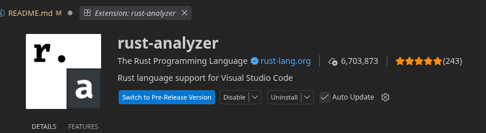
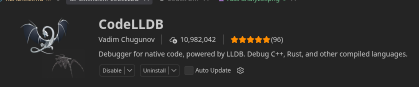
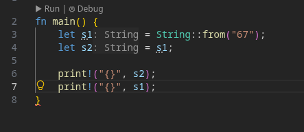
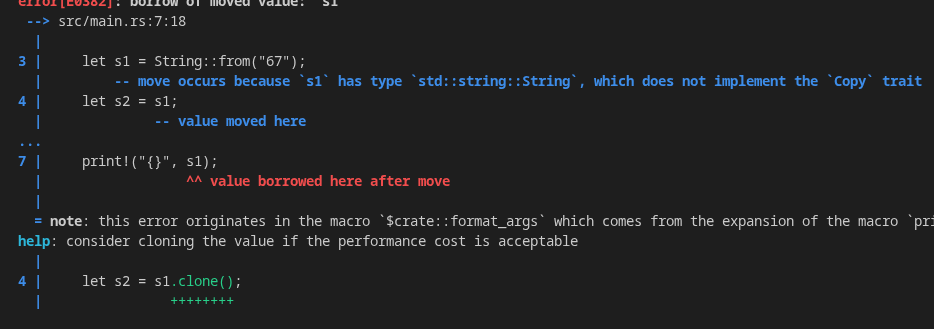

# NOTE

I'm neither a 162 TA nor a CS major, so some of the stuff here might not be factual or the best guidance for getting started with CS 162.
I'm completely unfamiliar with stuff like async Rust and Tokio, so I won't cover them in this article.
This is just to help my friends who have never touched Rust learn the basics. Also, I've referenced the book various times
throughout this article with the corresponding section numbers from the Rust book, so that might also be a good resource to check out.

https://doc.rust-lang.org/stable/book/title-page.html

## Intro

So, after midterm 1, you probably saw that HW3 gives you the option to use one of two languages: C or Rust. What is Rust? Well, this
explanation could be very long, but in short, Rust is a systems programming language known to be both fast and memory safe!
This means that problems in your code, such as dangling pointers or memory leaks, are caught at compile time
rather than at runtime, making code safer in "theory"! So, no more annoying segfaults or "memory leaks" in your code.

But a couple of you might be thinking to yourselves, "That sounds good, but how do I get started?" Well, this article is going to
get to that, but first, I'll give you some warnings before you start your Rustacean journey.

### Rust is difficult

Rust is different from many programming languages, as its compiler is really strict, meaning that it forces you to write better
code. You are going to be battling with the borrow checker for what feels like ages. But that's okay because you'll
learn. Don't get discouraged after a couple of failed attempts.

### Rust isn't immune to memory leaks

Although Rust is, in theory, 100% memory safe, as mentioned earlier, you can easily get memory leaks in safe Rust with
`Rc<T>` and various other parts of the standard library. I do agree that it's harder to get memory leaks in Rust, but at the end of
the day, it's still possible. If you want to read more about it, I've linked an article below that explains it.

### Rust doesn't prevent logic errors

Yeah, memory safety is cool and all, but at the end of the day, you still need to think logically. Rust doesn't check whether
you forgot to break out of an infinite loop or wrote endless recursion inside a function. That's up to you, the programmer,
to check.

And if you are still reading at this point, what are some good resources to check out? Well, for starters, I'd recommend working through
https://rustlings.rust-lang.org/. I also recommend reading the official Rust book, since it covers async Rust.
But doing the Rustlings exercises WITH NO AI alongside the book will help.

## Where to start

First, make sure you install Rust.

macOS/Linux: `curl --proto '=https' --tlsv1.2 -sSf https://sh.rustup.rs | sh`

Double-check by typing `rustc -V` and `cargo -v`. They should work.

### VS Code setup

For VS Code, make sure you install the rust-analyzer extension.



Also, install the LLDB debugger, since it's the default for Rust.



## Cargo

Unlike C, Rust has a unified build system called Cargo. And after working with Make :skull:, you'll begin to love Cargo and its simplicity.

Some basic examples include:

- `cargo build`: This compiles your program and creates an executable.
- `cargo run`: This runs the executable.

There are other commands, but I don't think you need them for 162.

## Clippy

Typing `cargo clippy` runs Clippy, a tool that helps you catch mistakes when coding in Rust.

My favorite feature of Rust has got to be Clippy, by far. The reason is that it was vibe coding before vibe coding was a thing! I know, crazy. But let me show you some examples.



Right now, this code wouldn't compile. Instead of debugging with print statements, we can just type `cargo clippy`, and it shows us our error!



So, instead of asking AI for help, ask Clippy!

And now that you've gotten through the basics, let's get to coding in Rust!

## Basics

### Variables

So, before we get to any hard concepts in Rust, like borrowing or traits, let's first brush up on our programming basics.

Variables in Rust start off as immutable, meaning they are read-only by default. As in JavaScript and TypeScript, you use the keyword `let` to declare a variable.

```rust
    let num = 67;
```

Notice that you don't have to specify the type as you do in C, which saves you time. Now, if you want to change a variable's value, you need to specify `mut` before its name.

```rust
fn main() {
    let mut num = 67;
    num += 1;
}
```

### Data Types/Enums/Structs

Rust has unsigned and signed integers: `u8-u128` and `i8-i128`. It also has floats, `f8-f64`, and booleans, `true` and `false`.

It also has structs, but unlike C structs, Rust structs ensure proper alignment and use postfix type casting.

```rust
struct Ram {
    price: f64,
    gb: u32,
}

let ram_stick = {price: 9999.99, gb: 32};
```

If you don't want to use structs, you can use tuples.

```rust
    let tuple_example = ("John", 22, false);
```

Rust also has enums, which are very powerful when used with pattern matching.

```rust
enum IpAddrKind {
    V4 = 1,
    V6 = 2,
}
```

### Control Flow

Rust lets you use `if` and `match` EXPRESSIONS (this is where pattern matching comes into play) to control your code's logic.

```rust
fn main() {
    let cool_num = 8;

    if cool_num == 8 {
        println!("cool");
    } else {
        println!("not cool");
    }
}
```

You can assign the result of an `if` expression to a variable:

```rust
fn main() {
    let cool_num = 8;

    let cool_num_1 = if cool_num == 8 { println!("cool") } else { println!("not cool") };

    println!("{}", cool_num_1);
}
```

Instead of switch statements, Rust uses `match` expressions and allows pattern matching, which is also found in functional programming languages.

```rust
fn main() {
    let cool_num = 8;

    match cool_num {
        1 => println!("1"),
        8 => println!("8");
        _ => println("Default if nothing matched")
    }
}
```

Below is an example of how pattern matching can be used to produce powerful results.

```rust
fn describe_ip(kind: IpAddrKind) {
    let version = match kind {
        IpAddrKind::V4 => "IPv4",
        IpAddrKind::V6 => "IPv6",
    };
}
```

### Loops

Rust allows you to use `for` and `while` statements to control the logic of your code. But unlike `if` and `match`, they can't be assigned to variables.

### While

```rust
fn main() {
    let mut count = 0;

    while count < 3 {
        println!("{}", count);
        count += 1;
    }
}
```

### For

In C, you might write `for (int count = 0; count < 3; count++)`. In Rust, a `for` loop goes through the values in an iterator, such as a range:

```rust
fn main() {
    for count in 0..3 {
        println!("{}", count);
    }
    /// This would print 0, 1, and 2 on separate lines.
}
```

But unlike C, you can also loop directly over an array without keeping track of an index:

```rust
fn main() {
    let numbers = [10, 20, 30];

    for number in numbers {
        println!("{}", number);
    }
    /// This would print 10, 20, and 30 on separate lines.
}
```

As in C, you can use `break` and `continue`.

### Strings and Vectors

Here's a basic `String` in Rust. Although there are many different kinds of strings, I'll be talking about owned strings allocated on the heap.

```rust
fn main() {
    let string_1 = String::from("Hello, I like OS!");
}
```

Vectors are dynamic arrays similar to ArrayLists in Java.

```rust
fn main() {
    let vector_1 = vec![1, 2, 3];
}
```

### Functions

Functions in Rust differ from those in C: you write `fn` with the function name right after it. The `->` introduces the return type. As a bit of syntactic sugar, you can omit the `return` keyword and implicitly return the final expression by leaving off its semicolon.

```rust
fn max(a: i32, b: i32) -> i32 {
    if a > b {
        return a;
    }

    b
}
```

Now that we've gone over the basics, let's move on to what makes Rust unique.

### Ownership

Just to make it clear, Rust wasn't the first to use ownership. Other languages, like C++, had it long before Rust was created. But what makes Rust different is that almost every value has a unique owner, meaning that a value is tied to one variable unless specified otherwise.

Remember when we got a compiler error earlier in the article? Well, that was the ownership model kicking in. Each value has a unique owner, and when you assign it somewhere else, you change the value's owner. When the owner goes out of scope, the value gets dropped, automatically freeing its resources.

```rust
fn main() {
    let value = String::from("I'm going to get dropped"); // The first owner, value, is created here.
    let value_2 = value; // Ownership moves from value to value_2.

    println!("{}", value_2);
} // value_2 gets dropped here.
```

But you might think we have to create multiple values if we want to reference the original. Although we can use `.clone()`, that's expensive and isn't efficient. But fear not: the next topic is what makes Rust memory safe!

### Borrowing/References

Let's start with references. This is by far the most important aspect of Rust, so if you don't get it the first time, make sure you reread it. Much like the pointers you've been using in C, Rust has references, indicated by `&`. A reference is kind of like a pointer, but it can't be null! That means you can't use NULL as a reference: it must refer to a value. You no longer have to write 500 lines of null checks just to be sort of safe. The compiler does it for you! Like raw pointers, references allow us to view a value cheaply without having to copy it.

```rust
fn main() {
    let s1 = String::from("hello");

    let len = calculate_length(&s1);

    println!("The length of '{s1}' is {len}.");
}

fn calculate_length(s: &String) -> usize {
    s.len()
}
```

In the example above, we borrow `s1` through the reference `s`, giving us a non-owning view of the string so we can get its length.

If you want to dereference a reference to get its value, use `*`.

```rust
fn main() {
    let s1 = 67;

    add_one(&s1);
    println!("first {}", s1); // prints 67
}

fn add_one(s: &u64) {
    let i = 1 + *s;
    println!("{}", i) // prints 68
}
```

But what happens if we return a reference? Short answer: you can't!

```rust
fn main() {
    let reference_to_nothing = dangle();
    println!("{}", reference_to_nothing);
}

fn dangle() -> &String {
    let s = String::from("hello");

    &s
}
```

This is what happens:


This is much like returning a dangling pointer or trying to access an old array that was reallocated: the value went out of scope when the function returned. But unlike C and C++, which don't have compile-time checkers for this, Rust ensures memory safety with the borrow checker.

### Borrow checker

This is how Rust ensures memory safety, and I believe it's currently the only language with this feature. Borrow checking makes sure that a reference never outlives the value it refers to. It checks for dangling references to make sure you never access a value that is no longer valid.

In our previous example, we were trying to access a value that had gone out of scope, leading to a dangling reference. This is bad, and you should avoid doing it. This is even highlighted in the Rust book:

```
In languages with pointers, it’s easy to erroneously create a dangling pointer—a pointer that references a location in memory that may have been given to someone else—by freeing some memory while preserving a pointer to that memory. In Rust, by contrast, the compiler guarantees that references will never be dangling references: If you have a reference to some data, the compiler will ensure that the data will not go out of scope before the reference to the data does.
```

This is the main reason why so many people love Rust. Its ability to catch dangling references saves countless hours of debugging.

### Mutable References

But let's say that you want to make a small change to your original value. You may find mutable references useful! They allow you to borrow the original value and make a slight change.

```rust
fn main() {
    let mut s = String::from("hello");
    change(&mut s);
    println!("{}", s); // Prints the modified string: hello, world
}

fn change(some_string: &mut String) {
    some_string.push_str(", world");
    println!("{}", some_string); // Prints: hello, world
}
```

Rust is also unique, as it's the only language that ensures data race safety by allowing only one mutable reference at a time and preventing mutable references from coexisting with shared references to the same value.

```rust
    let mut s = String::from("hello");

    let r1 = &s; // no problem
    let r2 = &s; // no problem
    println!("{r1} and {r2}");
    // Variables r1 and r2 will not be used after this point.

    let r3 = &mut s; // no problem
    println!("{r3}");
```


### Error Handling

In C, you've gotten used to returning either NULL or -1 when you encounter an error. Other languages, like C++, use exceptions to handle errors. But Rust takes a different approach with `Result` and `Option`. What are these? Well, first you have to read an entire book on category theory and learn functional programming!


Joking aside, Rust lets you represent errors or absent values explicitly rather than returning -1 or NULL.

### Option

First, let's get to `Option`. It represents an optional value: either `Some(value)` when a value is present or `None` when it is absent. `Option` is most commonly used with pattern matching.

```rust
let x: Option<u32> = Some(2);

let x: Option<u32> = None;
```

Here are some examples of how to use `Option`:

```rust
fn divide(numerator: f64, denominator: f64) -> Option<f64> {
    if denominator == 0.0 {
        None
    } else {
        Some(numerator / denominator)
    }
}

// The return value of the function is an Option.
let result = divide(2.0, 3.0);

// Pattern match to retrieve the value
match result {
    // The division was valid
    Some(x) => println!("Result: {}", x),
    // The division was invalid
    None    => println!("Cannot divide by 0"),
}

if let Some(x) = divide(2.0, 3.0) {
    println!("Result: {}", x);
} else { // The result is None.
    println!("Cannot divide by 0");
}

```

### Result

`Result` has two variants: `Ok(T)` when an operation succeeds and `Err(E)` when it fails. Returning an error is similar to returning -1 to indicate an error in C.

```rust
use std::fs::File;

fn main() {
    let greeting_file_result = File::open("hello.txt");

    let greeting_file = match greeting_file_result {
        Ok(file) => file,
        Err(error) => panic!("Problem opening the file: {error:?}"),
    };
}

// You can also use the same pattern-matching approaches as with Option. I'm just tired because it's 2:00 AM.
```

You might be wondering, "What does `?` do?" The `?` operator extracts a successful value or returns early if it encounters `Err` or `None`.

But what about `.unwrap()`? It's a bit controversial, with many people either for or against it. It was even featured in a Low Level video. But why does `.unwrap()` lead to so many debates?

### Unwrap and better ways around it

The concern with `.unwrap()` is that it can cause a panic and make debugging harder.

```rust
fn main() {
    panic!("something went wrong");

    println!("This will never run");
}
```

```
thread 'main' panicked at src/main.rs:2:5:
something went wrong
note: run with `RUST_BACKTRACE=1` environment variable to display a backtrace
```

One alternative is to use `.expect(msg)`, which is like `.unwrap()`, except it lets you provide your own error message.

```rust
fn main() {
    let value: Option<i32> = None;

    let x = value.expect("value was missing");

    println!("{x}");
}
```

A better way is to use `.unwrap_or(value)`:

```rust
fn main() {
    let value: Option<i32> = None;

    let x = value.unwrap_or(100);

    println!("{x}"); // prints 100
}
```

Another way is to use `.unwrap_or_else(...)`:

```rust
fn main() {
    let value: Option<i32> = None;

    let x = value.unwrap_or_else(|| {
        println!("Generating fallback...");
        100
    });

    println!("{x}");
    // Generating fallback...
    // 100
}
```

So, these are some effective ways to handle errors.

### Conclusion

Hope this helps. 

# Credit

Memory leaks are possible:
https://www.rustfaq.org/en/how-to-avoid-memory-leaks-in-rust-yes-theyre-possible/

Rust book:
https://doc.rust-lang.org/stable/book/ch03-01-variables-and-mutability.html

Option:
https://web.mit.edu/rust-lang_v1.25/arch/amd64_ubuntu1404/share/doc/rust/html/std/option/index.html
https://doc.rust-lang.org/std/option/enum.Option.html
